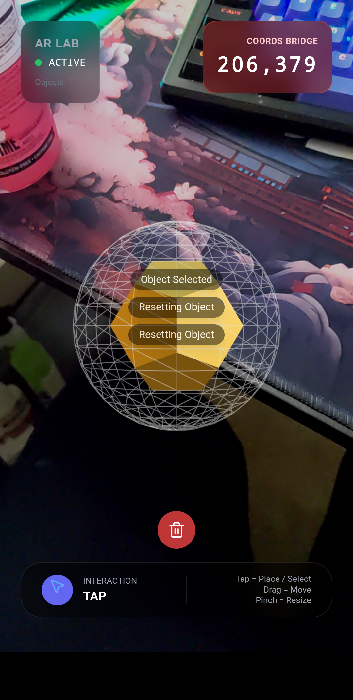
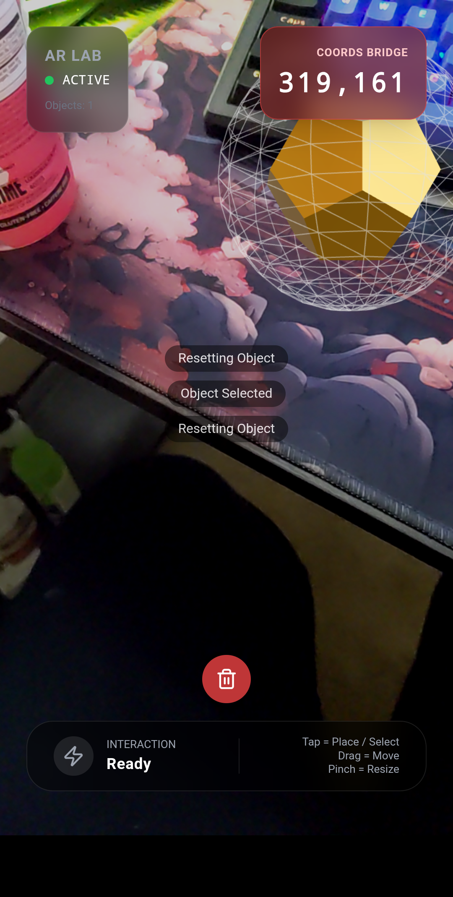

# AR Gesture Lab: Appium Automation

This project is an **Augmented Reality (AR) Gesture Lab** built with React, Three.js, and R3F (React Three Fiber). It demonstrates how to handle various mobile touch gestures (Tap, Drag, Long Press, Pinch) on a 3D object and provides **real-time coordinate feedback** essential for robust mobile automation testing.

The core of this repository is the **Appium automation script** (`app.py`), which uses a "Coordinate Bridge" technique to reliably test gestures on the dynamically positioned 3D object.

---

## 🔬 Core Components and Technology

* **Frontend:** React, Vite, Tailwind CSS
* **3D Rendering:** Three.js via `@react-three/fiber` and `@react-three/drei`
* **Gesture Handling:** `@use-gesture/react` and `@react-spring/three`
* **Automation:** Appium with Python and the Selenium WebDriver client

The application is structured to request the camera permission for an AR experience, though it includes a fallback for emulator testing.

---

## 🚀 Appium Automation Strategy: The Coordinate Bridge

The Appium script needs to know the exact screen coordinates of the 3D object to perform precise gestures like **Drag & Drop** and **Long Press**. Since 3D objects move in 3D space, their 2D screen projection changes every frame, which complicates traditional automation.

### How it Works:

1.  **Coordinate Projection:** The `GestureObject.tsx` component calculates the 3D object's world position, projects it to 2D screen pixels, and updates this value continuously using `useFrame`.
2.  **DOM Bridge:** The `App.tsx` component exposes these screen coordinates to the DOM via a dedicated, visible `div` element with the ID `ar_coords_textview`.
3.  **Appium Read:** The `app.py` script waits for this element, reads the `(x, y)` coordinate string from its text content using `get_ar_object_coords`, and then executes the next gesture at that precise location.

This method ensures the automation always interacts with the AR object, regardless of its position or the device's screen size.

---

## ⚙️ Setup and Execution Instructions

Follow these steps to set up the environment and run the Appium automation script on a connected Android phone or emulator.

### 1. Prerequisites

* **Node.js & npm**
* **Python 3 & pip**
* **Android SDK / ADB** configured in your environment path.
* **Appium Server** installed globally (`npm install -g appium`).
* **Mobile Chrome Browser** installed on your target device/emulator.

### 2. Install Project Dependencies

Open your terminal in the project root directory and install the necessary JavaScript and Python packages:

# Install Node dependencies (React, Vite, Three.js)
```bash
npm install
```

# Install Python dependencies (Appium Client, Selenium)
```bash
pip install Appium-Python-Client selenium
```

### 3. Start the Environment

Execute these commands in the specified order using **separate terminals**.

| Step | Command | Terminal | Description |
|------|---------|----------|-------------|
| **Step 1: Start Vite** | `npm run dev` | Terminal 1 | Starts the React app development server on **port 3000**. |
| **Step 2: Connect Mobile** | `adb reverse tcp:3000 tcp:3000` | Terminal 1 | Forwards the host port to the mobile device so it can access `localhost:3000`. |
| **Step 3: Start Appium** | `appium --allow-insecure '*:chromedriver_autodownload'` | Terminal 2 | Starts the Appium server and enables automatic ChromeDriver handling. |
| **Step 4: Open App** | _Manual Action_ | Mobile Device | Open Chrome on the device and go to **http://localhost:3000**. |

## 4. Run the Automation Test 🚀

Once the application is running in **Chrome** and the **AR LAB status shows ACTIVE**, you can execute the Appium test script.

---

### Execution Steps

| Step | Command | Terminal | Description |
| :--- | :--- | :--- | :--- |
| **5** | `python app.py` | Terminal 3 | Runs the Appium test sequence. The script will **prompt you (Y/N)** before performing each gesture. |

---

### Test Sequence Overview

The Appium test script performs the following sequence of gestures on the AR object. The images below provide visual confirmation for the state *after* each action is completed.

| Gesture | Image | Description |
| :--- | :--- | :--- |
| **Tap** |  | Places a new 3D object at **(206, 379)** and selects it. |
| **Long Press** |  | Resets the object's scale and rotation back to initial values. |
| **Drag & Drop** |  | Moves the object to a new screen location, now at **(319, 161)**. |
| **Pinch Out** |  | Increases the object's scale (grows the object). |
| **Pinch In** |  | Decreases the object's scale (shrinks the object). |
